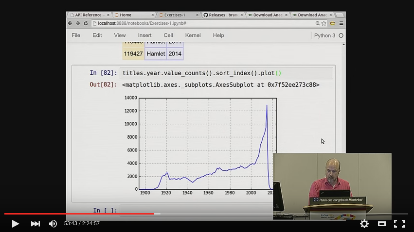

This lecture is based on the tutorial given by [Brandon Rhodes](https://twitter.com/brandon_rhodes) at PyCon 2015. It is highly recommeded to watch the entire talk:

[](http://www.youtube.com/watch?v=5JnMutdy6Fw "Pandas From The Ground Up - PyCon 2015")

https://www.youtube.com/watch?v=5JnMutdy6Fw


This is arguably the **best** pandas tutorial out there, and he also gives some awesome tips and tricks of working with jupyter notebooks.
Go through his talk for the functions mentioned in the [Cheat Sheet](./cheat-sheet.txt) that were not covered in the lecture. 

## Quick Start

```bash
pip install pandas # get pandas if you don't have it
bash get_data.sh # download and extract dataset
```

___

### Important Links

* [Brandon Rhodes's original repository](https://github.com/brandon-rhodes/pycon-pandas-tutorial)
* [Cheat Sheet](./cheat-sheet.txt)
* [Link to Full Tutorial on YouTube](http://www.youtube.com/watch?v=5JnMutdy6Fw)